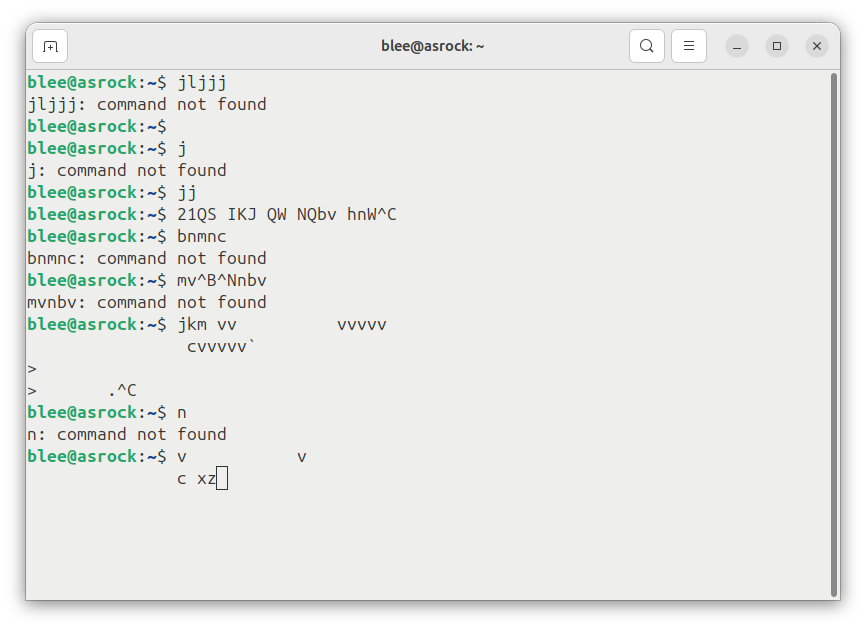

# Clap-clap on-off switch

## Single pulse generation from two consecutive pulses: signal processing and windowing

## Version 1.0

Only signal processing section of the circuit board (black silk screened PCB) is usable since circuit diagram is lost.

## Version 1.1

## Next version

## Pulse windowing logic implemented in an MCU (Arduino, etc)

